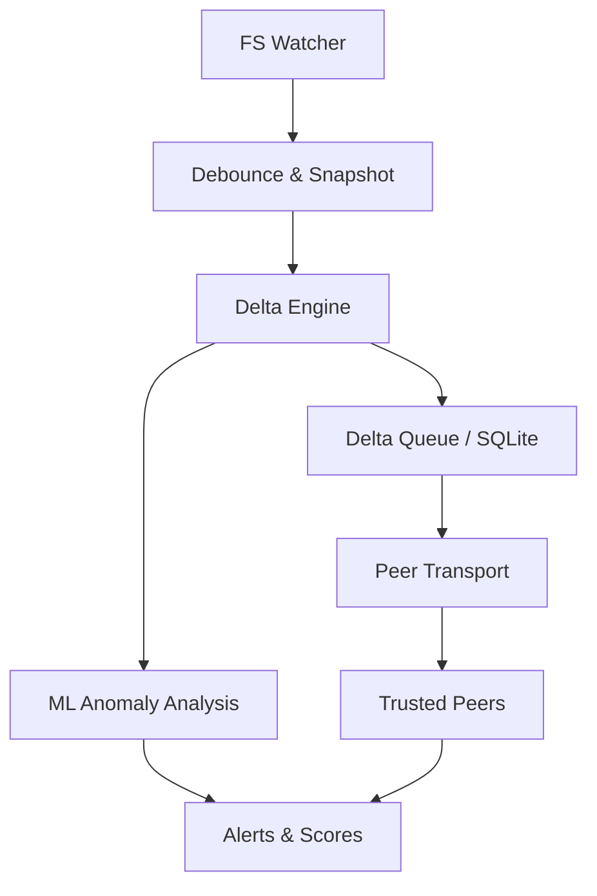

# Sentinel Edge

Güvenilir peer'lar arasında dosya değişimlerini gerçek zamanlı, overwrite etmeden, davranış bazlı güvenlik farkındalığıyla senkronize eden P2P dosya evrimi sistemi.

## Problem

Mevcut dosya senkronizasyon çözümleri:
- Merkezi servislere bağımlı
- Tam dosya gönderimi veya gecikmeli senkronizasyon
- Güvenlik açısından davranış farkındalığı yok
- Offline → online dönüşünde veri kaybı ve conflict'ler

## Çözüm

Sentinel Edge, 2-32 cihaz arası **değişim**, **güvenilir peer** ve **davranış** odaklı bir senkronizasyon sağlar.

## Sistem Akışı



## Planlanan Proje Yapısı

```
sentinel_edge/
├── docs/
│   └── contribs_here/
│       ├── MVPDESIGN.md           # Sistem tasarımı
│       ├── WHATRWEDOING.md        # Problem tanımı
│       ├── security/
│       │   └── SECURITY_LINES.md  # Güvenlik katmanı
│       ├── peers/
│       │   └── PEERMODEL.md       # Peer kimlik ve trust
│       ├── sqlite/
│       │   └── DATA_MANAGEMENT.md # Veri yönetimi
│       ├── ml_anomaly_detection/
│       │   └── ANOMALY.md         # ML anomali taraması
│       └── delta/
│           ├── EVENTS_DELTA.md    # Event ve delta modeli
│           └── FSEVENT(DELTA_PIPELINE.md # Pipeline akışı
├── src/                           # (planlanan)
│   ├── core/
│   │   ├── fs_watcher.py         # Dosya sistemi izleme
│   │   ├── delta_engine.py       # Delta üretimi
│   │   └── snapshot.py           # Block-level snapshot
│   ├── transport/
│   │   ├── tls_transport.py      # TLS 1.3 + mTLS
│   │   └── peer_manager.py       # Peer bağlantı yönetimi
│   ├── storage/
│   │   ├── sqlite_manager.py     # SQLite işlemleri
│   │   └── delta_queue.py        # Delta kuyruğu
│   ├── ml/
│   │   └── anomaly_detector.py   # Davranış analizi
│   └── api/
│       ├── routes.py             # API endpoint'leri
│       └── middleware.py         # Güvenlik katmanı
└── tests/                        # (planlanan)
```

## Modüller ve Routing

### Core Module
- **FS Watcher**: OS-level event'leri tetikler
- **Delta Engine**: Literal/reference delta üretir
- **Snapshot**: Immutable, block-level snapshot'lar

### Transport Layer
```python
# Planlanan routing yapısı
/peers/
├── POST /connect          # Yeni peer bağlantısı
├── POST /trust/{peer_id}  # Trust verme
├── DELETE /trust/{peer_id} # Trust kaldırma
└── GET /status           # Peer durumu

/delta/
├── POST /push            # Delta gönderme
├── GET /pull/{peer_id}   # Delta çekme
└── GET /queue/status     # Kuyruk durumu

/files/
├── GET /list             # Dosya listesi
├── GET /history/{file_id} # Dosya geçmişi
└── POST /snapshot/{file_id} # Snapshot oluşturma

/alerts/
└── GET /ml               # ML uyarıları
```

### Security Module
- TLS 1.3 + Mutual TLS
- Ed25519 kriptografik kimlik
- Explicit trust modeli (trusted/revoked)
- Append-only log ile integrity

### Storage Module
- SQLite WAL mode (crash-safe)
- 6 ana tablo: peers, files, changes, delta_queue, file_snapshots, anomaly_scores
- BLOB'lar disk dışı tutulur

### ML Module
- Davranış sinyalleri: delta frekansı, entropy, block pattern
- Threshold-based scoring
- Sadece uyarı, active blocking yok

## Başlarken (Tasarım Aşaması)

⚠️ **Not**: Sentinel Edge şu anda tasarım aşamasındadır. Çalışan kod henüz mevcut değildir.

## Sentinel Edge Ne Değildir?

Sentinel Edge şu ürünler değildir:
- ❌ Public cloud storage (Dropbox, Google Drive gibi)
- ❌ Dosya paylaşım platformu (WeTransfer gibi)
- ❌ Virüs tarayıcı (dosya içeriği taramaz)
- ❌ Backup ürünü (yan ürün olabilir)

Bunlar yerine **P2P dosya evrimi** ve **davranış bazlı güvenlik** odaklıdır.

## Katkı

1. Fork et
2. Feature branch oluştur (`git checkout -b feature/amazing-feature`)
3. Commit yap (`git commit -m 'Add amazing feature'`)
4. Push yap (`git push origin feature/amazing-feature`)
5. Pull Request aç

## Lisans

MIT License - [LICENSE](LICENSE) dosyasına bakın

## İletişim

- Sorular için: [GitHub Issues](https://github.com/reicalasso/sentinel_edge/issues)
- Tartışmalar için: [GitHub Discussions](https://github.com/reicalasso/sentinel_edge/discussions)

---

**Sentinel Edge** - Kontrol sizde, güvenlik sistemde.
